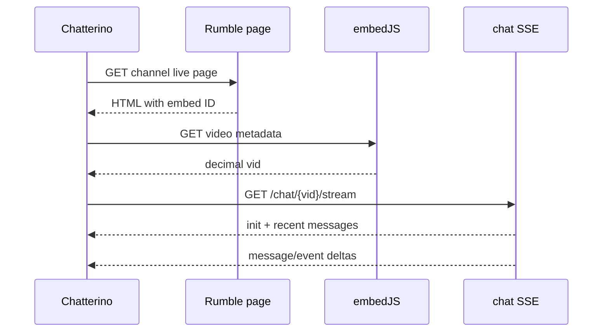

# Rumble protocol contract

Status: discovery contract for issues #15 and #18; not an assertion that the
undocumented interfaces below are stable or approved for production use.

Last reviewed: 2026-07-17.

## Evidence and status vocabulary

This document deliberately separates Rumble's documented Live Stream API from
interfaces observed in the web client. The four status values mean:

- **supported**: documented by Rumble and suitable for the stated use.
- **unsupported**: Rumble documents behavior that does not meet the use case.
- **unknown**: no reliable contract or observation is available.
- **unstable**: observed in Rumble's web client or the preserved experimental
  branch, but not documented as a public API. Treat it as versioned input that
  can change without notice.

Evidence, in descending order of authority:

1. [Rumble Live Stream API v1.1 documentation][official-live-api], last updated
   by Rumble on 2025-11-20.
2. Public page and network behavior observed by the earlier experimental work,
   preserved on [`ai/rumble-support-scratch-20260712`][scratch-branch], plus a
   sanitized inspection of the current inline `RumbleChat` client on
   2026-07-17. The branch is evidence only: it contains unintegrated code and
   must not be cherry-picked wholesale.
3. Explicit unknowns and a sanitized capture plan for issue #18.

The official Live Stream API is a creator/overlay feed, not a general public
chat-client API. Its generated URL embeds the user ID and live-stream key.
Rumble says no additional authentication is required, but also says to share
the URL only with trusted parties and that resetting it revokes access. It
contains up to 50 recent chat messages/rants, and livestream fields are
populated only while the owner's stream is live. Consequently:

- it is **supported** for a creator importing their own secret read-only feed;
- it is **unsupported** as Chatterino's arbitrary-public-channel discovery or
  realtime transport; and
- the complete URL is a bearer secret and must never appear in source,
  fixtures, logs, layouts, diagnostics, crash reports, or PR text.

## Capability inventory

| Capability | Contract or observation | Status | Downstream action |
|---|---|---|---|
| Creator-owned live metadata, recent chat, badges, rants | Secret v1.1 Live Stream API URL; JSON includes `livestreams[].id`, `is_live`, `chat.recent_messages`, badges, rants, likes/dislikes, and viewer count | supported, read-only | Optional adapter only; never require a creator key for ordinary viewing |
| Resolve arbitrary public channel to current stream | Fetch `/c/<slug>/live/`, then `/user/<slug>/live/` as a legacy-profile fallback; use a present first-card duration as the page status, otherwise resolve one unambiguous embed through `/embedJS/u3/` | unstable; duration marker observed 2026-07-17 and marker-less live page observed 2026-07-18 | Keep HTML/embed parsing behind the bounded resolver and fixture tests |
| Anonymous history and realtime chat | Server-Sent Events (SSE) stream at the observed chat endpoint; initial event includes recent messages | unstable | #18 fixtures first; #9/#22 implement only behind a replaceable transport |
| Public offline state | A present first outer video card has a positive duration; without that marker, missing live embed metadata or anonymous SSE HTTP 204 establishes offline | unstable; fallback revalidated 2026-07-18 | Treat an available page marker as authoritative; otherwise keep embed/SSE fallback bounded and re-resolve on a bounded timer |
| Channel tab name | An explicit embed `channel_title` is stable channel presentation metadata; a channel live-page document title describes its current video | unstable | Prefer `channel_title`, otherwise retain the persisted channel slug; never rename a channel or multi-channel child from the page/video title |
| Account/session lookup | Short-lived installed-browser acquisition plus `user.has_unread_notifications` probe and OS credential storage | unstable; probe live-validated 2026-07-17, native browser acquisition requires attended release smoke | Keep acquisition replaceable, validate before storage/use, and fail closed when browser, keyring, or probe fails |
| Password login and 2FA | Legacy salt/hash and `user.2fa.*` service operations observed in experimental code | unstable, high risk | Do not ship until independently revalidated; prefer browser/session import or a documented authorization flow |
| Send normal text | Observed chat JSON endpoint authenticated by `u_s`; one acknowledgement live-validated 2026-07-17 | unstable; one imported-session send only | #20 may implement an at-most-once normal-text send with conservative local failure handling |
| Delete message | Observed chat JSON endpoint authenticated by `u_s` | unstable, unvalidated | Keep unsupported until separately validated and capability-gated |
| Pin/unpin and mute | Observed `chat.message.*` and `moderation.mute` service operations | unstable, outbound unvalidated | #12 implements scoped inbound state and explicit unsupported/unauthorized outbound capabilities; never infer moderator status from login alone |
| Native replies | No reply-parent field was identified in the observed send payload | unknown/unsupported | Do not synthesize a native reply contract; send the visible `@name` composer text once through the ordinary-message path |
| Native emotes | Public `emote.list` catalog keyed by resolved chat stream; global `r+` and plain channel shortcodes; ordinary colon-wrapped text send | unstable; observed in current public web client 2026-07-20 | Fetch with strict bounds, render only exact catalog members, and expose completion only with validated destination eligibility |
| Pagination beyond initial history | No cursor or documented public history endpoint identified | unknown | #9/#10 must expose “initial window only” until a cited contract exists |
| Formal rate limits and `Retry-After` semantics | Not documented for observed web-client endpoints | unknown | Use conservative bounded retries and honor `Retry-After` if present |

## Public read-only vertical slice

All URLs in this section are public web-client observations, not official API
guarantees. Keep literal construction in the Rumble provider boundary.

### 1. Resolve a channel or video

Accepted user forms should normalize to one of:

- decimal chat/stream ID (already resolved);
- a Rumble URL, including `/chat/popup/<decimal>`;
- a video/embed slug beginning with `v`; or
- a channel/profile slug.

For a slug, fetch these pages in order:

```text
GET https://rumble.com/c/<percent-encoded-slug>/live/
GET https://rumble.com/user/<percent-encoded-slug>/live/   # fallback
```

On a channel/profile page, inspect the first outer `videostream` video card.
Duration `0` means the first card is the active live item; a positive duration
means the channel is offline even if that card retains an embed reference and
the embed metadata retains a positive `vid`. Later cards never override the
first. Current channel pages can omit this legacy card entirely. A missing-card
page may continue only when the complete bounded document supplies one
unambiguous embed reference; embed metadata then decides whether playback is
live, and anonymous SSE must still produce a valid `init` before chat is
connected. A present first card with a missing, conflicting, negative, or
non-canonical duration fails closed.

For a live card or direct video page, extract the embed ID (`v` followed by
lower-case base-36 characters) from an embed URL or the page's equivalent
serialized metadata. Then resolve the decimal stream ID:

```text
GET https://rumble.com/embedJS/u3/?request=video&ver=2&v=<embed-id>
```

Observed success is a JSON object with a positive integer `vid`. On an HTML
page without the first-card marker, absence of an embed ID or `vid` means
unavailable/offline for this attempt, not that the channel is invalid. HTML
patterns and the `embedJS` shape are unstable and remain covered by sanitized
fixtures. Current decoded pages can continue with a large unrelated inline
application after the resolver contract. A sanitized 2026-07-17 video page
was 1,827,560 bytes, while its title and structured embed reference were
complete by about 631 KiB. Native and validator readers therefore process the
page in bounded chunks and close it as soon as the title, first-card duration,
and embed reference form an authoritative channel prefix. A page which does
not produce that prefix is read to its bounded end so the marker-less fallback
can be evaluated, and still fails at 4 MiB; embed JSON remains independently
bounded at 256 KiB.

### 2. Bootstrap and continue chat

```text
GET https://web7.rumble.com/chat/api/chat/<decimal-stream-id>/stream
Accept: text/event-stream
Cache-Control: no-cache
Origin: https://rumble.com
Referer: https://rumble.com/
Cookie: u_s=<session>        # omit for anonymous read-only use
```

SSE blocks use standard `data:` lines containing one JSON object. Observed
event shapes are:

The native transport's 2 MiB/64-chunk SSE allowance is a bounded
pending-delivery window, not a lifetime response-size limit. When an initial
burst fills that window, the reader leaves bytes in `QNetworkReply` and resumes
after the queued callback releases room. Complete records are removed from the
API buffer as they are parsed; an individual unterminated/oversized record
still fails at the separate 1 MiB event bound. Finite page and embed requests
continue to use cumulative response bounds. Limit diagnostics identify the
request stage as `page_body_limit`, `embed_body_limit`, or `sse_body_limit`.

- `type: "init"`: array-valued `data.users` and `data.channels`,
  `data.config.badges` with labels and static 48/96-pixel icon paths,
  `data.config.message_length_max`, and array-valued `data.messages`;
- `type: "messages"`: array-valued user/channel deltas and new
  `data.messages`;
- `type: "delete_messages"`: `data.message_ids`;
- `type: "delete_non_rant_messages"`: IDs or a clear-non-rant signal; and
- `type: "pin_message"`: `data.message`.

The initial message array is the only identified anonymous history source.
Each user/channel record carries its own `id`; these catalogs are not JSON
objects keyed by ID. Message records use `time` for the ISO-8601 timestamp,
allow string or integer IDs, and may omit `channel_id`. Sort the initial window
by `time` before publishing it. Deduplicate later events by message ID across
reconnects. Unknown event types must be logged without raw payloads and
otherwise ignored; they must not disconnect the stream. Because the entire
catalog and history arrive in one SSE record, the reader permits a bounded
1 MiB event rather than the previous 64 KiB limit.

Observed HTTP 204 means no live chat stream, but it is not the channel-status
authority. Re-run HTML channel resolution after a bounded delay. Other non-2xx
responses and network failures are connection errors, not evidence that a
channel is offline.

### Minimal anonymous sequence



No request in this sequence requires a user credential in the observed design.
That property must be revalidated with #18 fixtures and a bounded live smoke
test before it is labelled supported.

### Native-emote catalog and occurrence contract

After resolving the decimal chat stream, the current public client fetches:

```text
GET https://rumble.com/service.php?name=emote.list&chat_id=<decimal stream ID>
Accept: application/json
```

The JSON `data.items[]` groups have `id`, nullable `channel_id`, and
`emotes[]`. An emote has string `name`, boolean `is_subs_only`, unsigned
integer `position`, and string `file`. A null channel is the global group and
its observed names begin with `r+`; a non-null channel is destination-scoped
and its observed names are plain. `r+` is therefore global naming, not an
eligibility bit. Subscription eligibility comes only from `is_subs_only` and
the current account snapshot.

Message blocks contain ordinary text rather than ranges. The public client
builds a map from the accepted catalog and matches exact, case-sensitive
`:(r+)?[A-Za-z0-9]+:` tokens. It inserts and sends the same colon-wrapped text.
Chatterino mirrors that rule and never recognizes a token absent from the
catalog. Provider identity is group ID plus provider position, not name, URL,
or local array offset. See `rumble-assets.md` for URL policy, bounds,
eligibility, invalidation, and immutable message snapshots.

## Identifiers, ordering, and deduplication

| Value | Observed representation | Stability decision |
|---|---|---|
| Channel/profile slug | URL path component | Human-readable locator, not a stable identity; persisted layouts need a migration path if a canonical numeric channel ID becomes available |
| Embed/video ID | `v` plus base-36 characters | Stable for resolving one video; do not confuse it with chat `vid` |
| Chat/stream ID | positive decimal `vid` | Stable for one live stream; a channel can receive a new value on the next stream |
| User ID | string, observed as base-36 and sometimes containing `_` separators | Preserve the original string in DTOs; numeric conversion is optional and must not be the identity source |
| Message ID | JSON string or integer depending on payload | Normalize losslessly to a string; primary reconnect deduplication key |
| Message time | ISO-8601 string in observed chat payload | Parse as an instant, retain original value for fixtures, order equal timestamps by arrival order |
| Client request ID | observed 43-character unpadded base64 value | Generate uniquely per send attempt; never reuse after an ambiguous response |

Do not use display name, username casing, emote name, array offset, or local
arrival time as a stable identity.

## Authentication and mutations

The following combines observations from the preserved experimental branch
with the sanitized schema-1 validation recorded in #40 on 2026-07-17. It is
not a supported login specification or a stable public API.

Requests use `https://rumble.com/service.php?name=<operation>` with
form-encoded fields. Observed operations include:

- `user.get_salts`;
- `user.2fa.first_step`, `user.2fa.request_email_code`,
  `user.2fa.request_sms_code`, and `user.2fa.verify_totp`;
- `user.login`;
- `user.has_unread_notifications` as a session/user probe;
- `chat.message.pin` / `chat.message.unpin`; and
- `moderation.mute`.

The observed session credential is the `u_s` cookie. It authenticates SSE and
mutation requests and therefore must be treated like a password. Chatterino
acquires it only from an isolated, short-lived installed browser controlled by
a matching Selenium-managed driver. The browser and driver exit before the
result is accepted. A read-only probe supplies the opaque account ID and
display name; QtKeychain stores the credential with insecure fallback disabled,
while normal settings contain only hashed storage nodes and non-secret account
metadata. Rejected, replaced, removed, and shutdown credentials are wiped from
their active in-memory buffers. Local removal does not claim remote
browser-session revocation.

Observed chat mutations are:

```text
POST   https://web7.rumble.com/chat/api/chat/<vid>/message
DELETE https://web7.rumble.com/chat/api/chat/<vid>/message/<message-id>
Origin: https://rumble.com
Cookie: u_s=<session>
Content-Type: application/json       # POST
```

The 2026-07-17 run established this narrow contract:

- an explicitly imported `u_s` session was accepted by a read-only
  `user.has_unread_notifications` probe returning HTTP 200 JSON with an
  authenticated-user shape;
- one POST with `Origin: https://rumble.com` and a JSON body containing
  `data.request_id`, `data.message.text`, nullable `data.rant`, and nullable
  `data.channel_id` returned HTTP 200 JSON with a non-empty `data.id`; and
- the client may treat only that response shape as a confirmed send. It must
  generate a fresh request ID and never retry a mutation automatically.

This run did **not** establish OAuth, password/2FA service calls, rotation or
expiry duration, remote logout/revocation, whether Origin or CSRF fields are
necessary rather than sufficient, formal rate limits,
message-length/normalization rules, or visible exactly-once delivery beyond the
acknowledgement. A 401/403 from the session probe must erase the rejected
in-memory session and fail closed. A send
401 invalidates the session pending a fresh probe; a send 403 makes that
destination non-writable and preserves the draft, clearing the session only if
the probe independently rejects it. HTTP 429 may delay future attempts and
honor a valid `Retry-After`, but must not retry the current send.
A timeout, network failure, HTTP 408/5xx, or malformed response after dispatch
is ambiguous and must be shown as “may have sent” without retrying. Delete,
moderation, and native reply metadata remain unsupported. A composed reply to a
Rumble message is instead submitted once as the complete visible ordinary text.
Catalog-backed native-emote completion uses the already-accepted ordinary text
send and adds no new mutation endpoint. Do not expand this contract by trial
and error.

## Packaged live validation

The root `rumble-validation` package turns the two remaining live-service
checks into bounded commands. Its deterministic fixture/redaction suite does
not contact Rumble:

```sh
nix run 'github:the-fpp/klatterino#rumble-validation-self-test'
```

Validate #36 with one approved channel that is currently live and one approved
channel that is deliberately offline:

```sh
nix run 'github:the-fpp/klatterino#rumble-validate-public' -- \
  --live-channel LIVE_TEST_SLUG \
  --offline-channel OFFLINE_TEST_SLUG
```

The public runner requires an anonymous SSE `init` and one controlled reconnect
for the live control. The offline control must be established independently by
an authoritative page marker, absent live embed metadata, or SSE HTTP 204. A
positive stream whose SSE returns a valid `init` cannot pass as the offline
control.

Validate the import-session and normal-text-send portion of #40 with an
approved live test channel and a throwaway/test account:

```sh
nix run 'github:the-fpp/klatterino#rumble-validate-authenticated' -- \
  --channel APPROVED_TEST_CHANNEL \
  --send
```

The authenticated runner requires the exact interactive confirmation
`SEND ONCE` and then reads `u_s` through a no-echo terminal prompt. It accepts
no token argument, environment variable, or path. It generates one benign test
message and a fresh request ID in memory, performs one POST, and never retries
an ambiguous result.

Issue #40 recorded a complete sanitized schema-1 report on 2026-07-17:
validator `1.0.0`, one mutation attempt, overall `PASS`, and result token
`RUMBLE_AUTHENTICATED_VALIDATION_V1=PASS`. The report contained no sensitive
values. This clears #20's external validation gate only for the narrow
import/probe/normal-text-send contract above.

Standard output is a complete Markdown report with fixed aliases and a closed
vocabulary. It contains no supplied locator, resolved ID, account name,
username, message text, request ID, URL, response body, raw header, raw network
error, or credential. Paste the complete report into #36 or #40 even when its
result is nonzero. Exit codes are:

- `0`: `PASS`;
- `2`: rejected command input or interactive confirmation;
- `10`: `INCONCLUSIVE_ENVIRONMENT`;
- `11`: `INCONCLUSIVE_INPUT_OR_REMOTE`;
- `12`: `CONTRACT_MISMATCH`; and
- `70`: internal invariant failure.

Work Mode can implement, fixture-test, package, review, and merge all of this
tooling. It cannot supply the operator's unrestricted Rumble network, select a
controlled channel that is live/offline at execution time, receive the private
`u_s` value, or authorize a real public message. The validator also does not
perform password/2FA login, persist a session, revoke/logout the browser
session, spoof origin/CSRF relationships, deliberately trigger 429, or force an
ambiguous production delivery. Those unavailable/destructive observations
must be recorded as such; conservative client behavior is covered by local
fixtures instead.

## Error, timeout, and reconnect contract

Downstream code should use these conservative defaults until Rumble documents
stronger behavior:

1. Apply a 20-second deadline to finite HTTP requests and to obtaining the
   final SSE response head. After a valid SSE head, use no idle/heartbeat
   timeout: no accepted contract currently defines such a signal. A future
   timeout requires an explicit documented contract rather than inference from
   incidental traffic.
2. Retry only transport errors, HTTP 408/429, and 5xx responses. Never retry a
   non-idempotent mutation automatically after an ambiguous response.
3. Honor `Retry-After`. Otherwise use exponential backoff with full jitter,
   starting near 1 second and capped at 30 seconds.
4. Limit initial bootstrap to three failed attempts, then expose a visible
   disconnected/error state. A user action can retry immediately.
5. HTTP 204 from the SSE endpoint is authoritative offline evidence and
   schedules a fresh page/embed resolution no more often than every 30 seconds
   while the channel remains open. A clean HTTP 200 SSE EOF or a gone/not-found
   stream endpoint is not offline evidence by itself: after bounded backoff,
   re-resolve the persistent public locator. Keep the last confirmed-live
   indicator through that revalidation; only a typed offline resolution clears
   it. A stale live page followed by another immediately-ended stream remains
   subject to the normal consecutive-failure cap instead of looping forever;
   a stream that remains connected for ten seconds or publishes a post-init
   provider event resets that stream-end-specific bound.
6. Cancellation owns the network reply and reconnect timer. Closing a channel,
   switching accounts, or application shutdown must prevent stale callbacks
   from publishing messages or starting another connection.
7. Reset backoff only after a valid `init` event. Preserve the message-ID
   deduplication set across reconnects for a bounded window.
8. Bound each response head to 96 fields and 64 KiB of aggregate decoded
   name/value bytes. This accommodates current CDN/security-policy headers
   while retaining structural validation and a finite ceiling. Page, embed,
   and SSE body limits remain separate and unchanged.
9. Normalize Qt's LF-separated representation of repeated `Set-Cookie`
   response fields into distinct fields before structural validation. Reject
   CR, NUL, empty cookie segments, and LF in every other response field.
10. A confirmed-offline transition makes the destination non-writable before
    any subsequent send transport starts, removes its completion eligibility,
    and emits `is_live:false` through the selected-tab plugin boundary. The
    follower consumes that state idempotently and does not re-run Streamlink
    until a later confirmed-live event.

These are client safety limits, not claims about Rumble's server limits.

## Sanitized fixture and capture plan for #18

Never record a full Live Stream API URL, cookies, request headers, private
messages, account email/phone, 2FA fields, stream keys, IP addresses, or unique
browser identifiers.

Capture with a purpose-created public test channel/account and replace values
before committing:

| Fixture | Required scenario | Sanitization |
|---|---|---|
| `channel-live.html` | first video card with duration zero and current embed reference | replace channel/video names and all unrelated scripts; preserve only minimal resolver structure |
| `channel-offline.html` | first video card with positive duration and stale embed reference | same as above; replace the duration and embed ID |
| `embed-live.json` | valid embed ID to positive `vid` | map IDs consistently to small documented values |
| `embed-offline.json` | unavailable/offline response | retain status and schema, remove tracking data |
| `sse-init.txt` | users, channels, badges, config, zero and multiple recent messages | replace all text/names/IDs; retain type distinctions and timestamps |
| `sse-deltas.txt` | message, duplicate, out-of-order, delete, pin, unknown event, malformed JSON | synthetic message text only |
| `sse-offline.txt` | HTTP 204 metadata | no body expected |
| `http-errors.json` | 401/403/404/429/5xx and `Retry-After` variants | hand-authored deterministic responses |
| `session-expired.json` | authenticated probe/send rejection | no cookie or real user data |

Each fixture needs a provenance sidecar containing observation date, public
versus authenticated classification, HTTP method/status/content type, fields
removed or replaced, and the test cases that consume it. Store neither packet
captures nor raw originals in the repository.

### Live/offline validation checklist

Run this as an explicitly manual smoke test, never in CI:

1. Select one intentionally public, currently live channel and one valid
   offline channel controlled by or approved for the test.
2. Resolve the live page through either its zero-duration first card or the
   marker-less, single-embed fallback; confirm a valid anonymous SSE `init`.
3. Perform one controlled reconnect and confirm another valid `init`.
4. Confirm offline through a positive first-card duration, absent live embed
   metadata, or anonymous SSE HTTP 204. A valid SSE `init` is not offline.
5. Confirm the client waits at least 30 seconds before offline re-resolution.
6. Record only the date, redacted channel aliases, statuses, timing ranges, and
   fixture hashes in the PR.

The sanitized 2026-07-17 Chrome observation established that the anonymous
browser uses the canonical `web7.rumble.com` stream endpoint without cookies,
with the fixed public `https://rumble.com` Origin and root Referer. Its single
raw Content-Type field repeats the same UTF-8 charset parameter twice; Chrome
normalizes the representation to `text/event-stream`. Raw URLs, IDs, messages,
and HAR content are not retained in the repository.

The operator's 2026-07-17 channel-page observation established that a present
first video/VOD-looking card is authoritative: duration `0` is live and a
positive duration is offline even when stale embed metadata remains reachable.
A credential-free 2026-07-18 observation also established a current live page
with no such card. Its page and embed resolved, anonymous SSE returned the
current valid `init` shape, and one controlled reconnect returned another valid
`init`. The packaged public validator therefore preserves the page-marker fast
path but requires the embed/SSE fallback whenever that legacy marker is absent.

The earlier 2026-07-12 execution-environment attempt received HTTP 403 at the
channel page. It remains historical evidence about that environment, not a
contradiction of the operator's later unrestricted 2026-07-17 HTML observation.

## Decisions for implementers

1. Build the first vertical slice as anonymous and read-only. Authentication is
   not a dependency for #9/#10/#11/#18/#22's public path.
2. Treat the official v1.1 creator API and the web-client SSE API as different
   transports with different trust models. Never feed a secret creator URL
   into the public-channel path.
3. Put raw HTML/JSON/SSE and all endpoint literals inside typed Rumble provider
   adapters. Application and UI code consume DTOs and explicit capability or
   error results.
4. Use Qt's existing HTTP stack and a small incremental SSE parser; do not add
   a Rumble SDK or a second general networking library.
5. Land #18's offline fixtures/transport before production endpoint code.
   Network access is forbidden in normal tests.
6. Label every undocumented operation `unstable` in code and user-facing
   capability diagnostics. Unknown moderation/emote behavior fails visibly.
7. Do not ship the observed password-hashing flow or plaintext settings token
   storage. Use the short-lived installed-browser flow, the read-only validity
   probe, OS credential storage without plaintext fallback, local account
   removal, and one at-most-once normal-text send. Never retry a mutation after
   dispatch.
8. Preserve string identifiers at provider boundaries, bound every retry loop,
   cancel callbacks with owner lifetime, and never perform network I/O during
   completion evaluation.

### Downstream issue map

- #18: capture the resolver/embed/SSE success and failure fixtures above and
  provide a fake transport.
- #9: implement typed page/embed/chat HTTP boundaries after #18.
- #10: parse only documented fixture shapes; unknown events remain explicit.
- #11: own channel lifetime and expose anonymous read-only capability first.
- #22: implement the bounded SSE lifecycle, offline re-resolution, and visible
  health state.
- #20: provides the bounded probe, native short-lived browser acquisition,
  secure multi-account storage/selection, and normal-text-send contract;
  every other authenticated capability remains unsupported or separately
  gated.
- #12: implements only scoped, idempotent inbound moderation state; every
  outbound moderation mutation remains explicitly unsupported pending a frozen
  accepted contract. See `rumble-moderation.md`.
- #13: established the conservative asset boundary; #101 supersedes only its
  native-emote limitation with the bounded current-client contract above.

[official-live-api]: https://rumble.support/help/how-to-use-rumble-s-live-stream-api
[scratch-branch]: https://github.com/the-fpp/klatterino/tree/main/deps/chatterino7/src/providers/rumble
